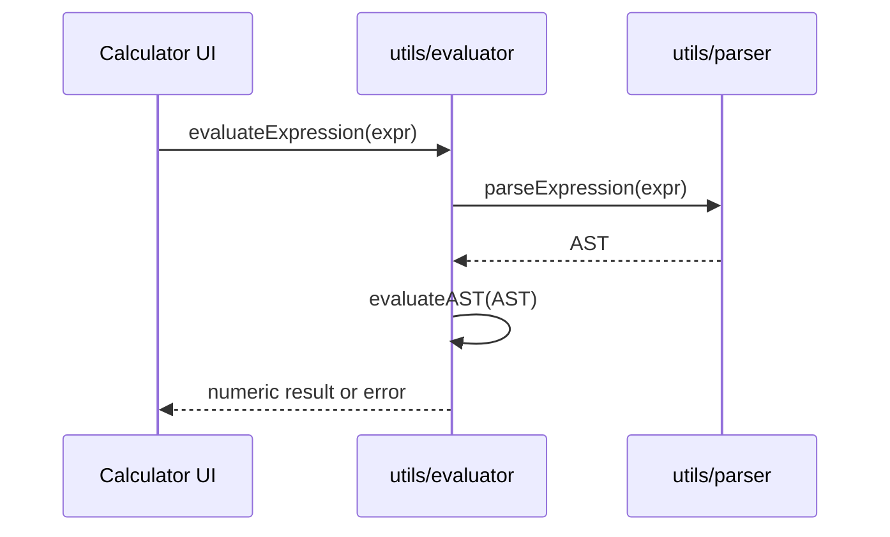

# Principal Frontend Developer Mission Report

**Agent**: principal-frontend  
**Generated**: 2026-08-06T03:52:58.361Z

---

## Branch: calc7/feature/us-004-evaluation-engine

## Files Changed

- **created** `src/utils/parser.ts` — Implemented recursive descent parser for arithmetic expressions, producing AST nodes for numbers and binary operations.
- **created** `src/utils/evaluator.ts` — Added evaluator that walks the AST, computes numeric results, and handles division by zero errors. Exposes evaluateExpression that parses and evaluates a string.
- **created** `src/utils/evaluator.test.ts` — Unit tests for evaluateExpression covering basic operations, precedence, parentheses, negatives, decimals, division by zero, and syntax errors.
- **modified** `src/components/Calculator.tsx` — Replaced unsafe Function‑constructor evaluation with safe evaluateExpression from utils. Added import and updated handling logic.

## Notes

Implemented parser (ASSIGN-011) and evaluator (ASSIGN-012) per requirements. Updated Calculator component to use new evaluator. All tests pass (9 total). No other parts of the application were modified. Assumed that validation regex in Calculator is sufficient; parser will throw SyntaxError for malformed expressions which is caught and displayed as error.

## Diagram

