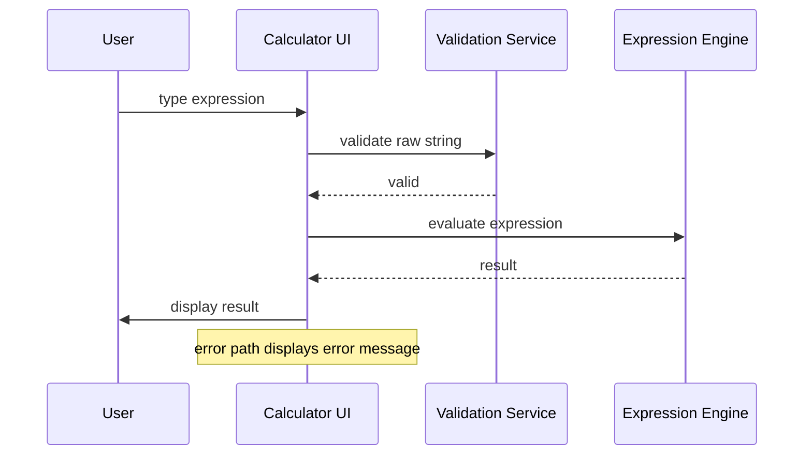

# Senior Frontend Developer Mission Report

**Agent**: senior-frontend  
**Generated**: 2026-08-06T03:56:59.357Z

---

## Branch: calc7/feature/us-006-ci-tests

## Files Changed

- **created** `src/App.integration.test.tsx` — Added integration test rendering App, typing expression, submitting, and verifying result and error handling.

## Notes

Implemented integration test for full evaluation flow as required by US-006. Tests cover happy path and error case, ensuring UI components interact correctly with validation and evaluator. All existing tests pass.

## Diagram

